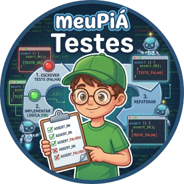

# meuPiá Testes – Módulo de Asserções e TDD



## 📖 Overview

> **Nota:** Este é um **plugin oficial** para o compilador [meuPiá](https://github.com/meuPia).

O **meuPiá Testes** introduz o conceito de **Desenvolvimento Orientado a Testes (TDD)** e Garantia de Qualidade (QA) no ensino de programação. Ele fornece uma suite de funções de asserção que permitem validar se a lógica de um algoritmo está produzindo os resultados esperados.

O objetivo é transformar a correção de exercícios em um processo automatizado e visual, onde o estudante recebe feedback imediato do compilador:

* **Feedback Semântico:** Mensagens claras no terminal indicando o que era esperado e o que foi recebido.
* **Padrão de Indústria:** Introduz o uso de *Asserts*, preparando o aluno para frameworks profissionais como PyTest ou Jest.
* **Integração com o Lab:** Tags especiais (`[TESTE_OK]`, `[TESTE_FALHA]`) que permitem ao **meuPiá Lab** renderizar indicadores visuais de progresso.

---

## 🚀 Installation

Utilize o gerenciador de pacotes do meuPiá (**mpgp**) para instalar a extensão.

```bash
# No terminal do Lab ou via VS Code
mpgp instale testes

```

---

## 🛠️ Usage Examples

### 1. Validando uma Função de Soma

Garantindo que a lógica matemática da função criada pelo aluno está correta.

```portugol
algoritmo "ValidarSoma"
usar "testes"

funcao somar(a, b)
    retorne a + b
fim_funcao

var resultado: inteiro
inicio
    resultado <- somar(5, 5)
    
    // Validação
    esperar_igual(resultado, 10, "A soma de 5 + 5 deve ser 10")
fimalgoritmo

```

### 2. Testando Algoritmos de Busca (IA)

Verificando se um item esperado foi encontrado em uma lista de resultados.

```portugol
algoritmo "TesteBusca"
usar "testes"

var nomes: tipo
inicio
    nomes <- ["Henry", "Alice", "Nathan"]

    esperar_contem(nomes, "Alice", "Alice deve estar na lista")
    esperar_falso(tamanho(nomes) == 0, "A lista não deve estar vazia")
fimalgoritmo

```

---

## 📚 API Reference

Abaixo estão as funções de asserção disponíveis:

### Comparações Diretas

* `esperar_igual(recebido, esperado, mensagem)`: Valida se os dois valores são idênticos (`==`).
* `esperar_diferente(recebido, esperado, mensagem)`: Valida se os valores são distintos (`!=`).

### Validações Lógicas

* `esperar_verdadeiro(condicao, mensagem)`: Verifica se a expressão resulta em `verdadeiro`.
* `esperar_falso(condicao, mensagem)`: Verifica se a expressão resulta em `falso`.

### Comparações Numéricas

* `esperar_maior(recebido, limite, mensagem)`: Verifica se `recebido > limite`.
* `esperar_menor(recebido, limite, mensagem)`: Verifica se `recebido < limite`.

### Coleções

* `esperar_contem(colecao, item, mensagem)`: Verifica se o item existe dentro de uma lista, vetor ou cadeia de caracteres.

---

## 🙌 Credits

Desenvolvido como parte do ecossistema educacional **meuPiá** por **[@henryhamon](https://github.com/henryhamon)**.

* **Core Compiler:** [meuPia-core](https://github.com/meuPia/core)
* **IDE:** [meuPia-lab](https://github.com/meuPia/lab)